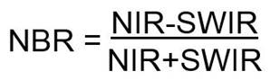
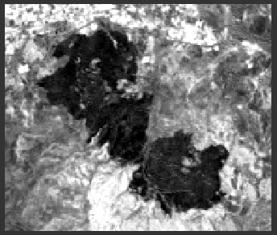

# GEO468E Jupiter Notebook Homework
This repository contains documentation and code for Normalized Burn Ratio(NBR) index application via Jupyter Notebook within this course. All the versions can be found at "Releases" tab. Please consider the last version named "GEO468E_nbr_v2.ipynb".

## Aim
Aim of this project is to show the burnt areas by applying the Normalized Burn Ratio index to the required satellite images. As a scope of this project, Menemen district of Izmir city is chosen. According to the official statements, the fire that broke out in Menemen on June 17, 2008 reached an impact area of approximately 500 hectares despite the air and land interventions of the İzmir Regional Directorate of Forestry and caused a total of 150 hectares of land to burn completely.

## Data
To apply NBR index, Landsat 5(TM) image is obtained from USGS Earth Explorer. Acquisition date is 01/08/2008 and path/row information is 180/33. Used bands are:
- Band 4: Near Infrared 
- Band 5: Shortwave Infrared

## Normalized Burn Ratio(NBR)
Healthy vegetation have a high reflectance in the NIR while they have low reflectance in the SWIR portion of the spectrum. Also for burnt areas that damaged from a fire show low reflectance in NIR and high reflectance in the SWIR. So NBR utilizes this opposite difference in order to show burnt areas according to the formula shown below.
- 
#### NBR Image of burnt area:
- 

### Thank you for your interest !
### This repository is prepared by Levent Doğukan Özlü.
If you need to get in touch, please feel free:
- ozlul17@itu.edu.tr
- 
